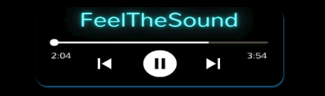
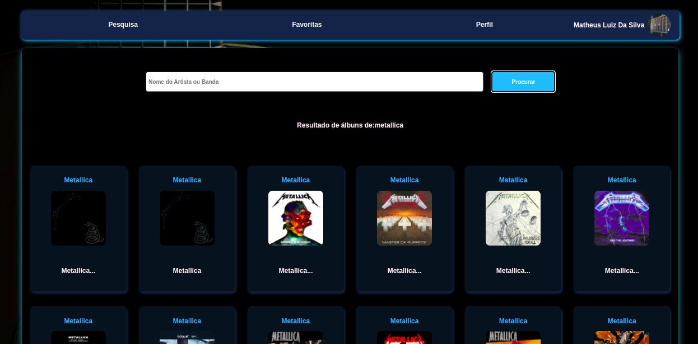

<h1 align="center">
    
  <i>FeelTheSound</i>
</h1>

## 💻 Projeto

Projeto do módulo de Front-End desenvolvido no Curso de Desenvolvimento Web da Trybe.
Este projeto tem como objetivo criar uma aplicação capaz de pesquisar e reproduzir músicas das mais variadas bandas e artistas.
A pessoa usuária poderá fazer o login com seu email e adicionar uma imagem de perfil. Após o login será possível realizar pesquisas de bandas e artistas, buscando diversos albuns referente ao artista pesquisado, sendo possível reproduzir as músicas do album, também criar uma lista de músicas favoritas e editar o perfil do usuário.

## Demonstração

<div align="center">
    
</div>

## Habilidades

Neste projeto, foram utilizadas as seguintes habilidades:

- Fazer requisições e consumir dados vindos de uma `API`;

- Utilizar os ciclos de vida de um componente React;

- Utilizar a função `setState` de forma a garantir que um determinado código só é executado após o estado ser atualizado

- Utilizar o componente `BrowserRouter` corretamente;

- Criar rotas, mapeando o caminho da URL com o componente correspondente, via `Route`;

- Utilizar o `Switch` do `React Router`

- Usar o componente `Redirect` pra redirecionar para uma rota específica;

- Criar links de navegação na aplicação com o componente `Link`;

## Screenshot



## Rodando o projeto localmente

Clone o projeto

```bash
  git clone git@github.com:Mathluiz23/Tunes.git
```

Entre no diretório do projeto

```bash
  cd tunes
```

Instale as dependências

```bash
  npm install
```

Inicie o projeto

```bash
  npm run start
