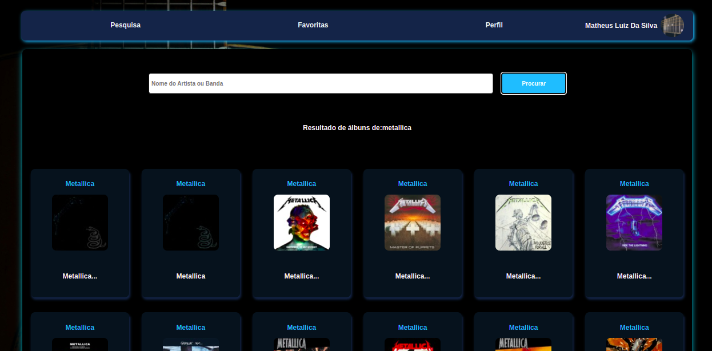

<h1 align="center">🎵 Tunes - Feel The Sound 🎵</h1>

## 🖥️📱 Deploy

You can access the deployed version of this project at the link below:

Click here: https://tunes-mathluiz23.vercel.app

## 💻 Project

This is a Front-End module project developed during the Web Development Course at Trybe.  
The goal of this project is to create an application capable of searching for and playing music from various bands and artists.

Users can log in using their email and upload a profile picture. After logging in, they can search for bands and artists, browse multiple albums related to the searched artist, play songs from the album, add songs to their list of favorites, and edit their user profile.

## ⏯️ Demo

<div align="center">
    
</div>

## 👨‍🔧 Skills

In this project, the following skills were applied:

- Make requests and consume data from an `API`.

- Use React component lifecycle methods.

- Use the `setState` function in a way that ensures code execution after state update.

- Use the `BrowserRouter` component correctly.

- Create routes, mapping URL paths to the corresponding components via `Route`.

- Use `Switch` from `React Router`.

- Use the `Redirect` component to redirect to a specific route.

- Create navigation links in the application using the `Link` component.

## Search Screen



## 👨‍💻 Running the project locally

Clone the repository

```bash
  git clone git@github.com:Mathluiz23/Tunes.git
```

Enter the project directory

```bash
  cd Tunes
```

Install dependencies

```bash
  npm install
```

Start the project

```bash
  npm start
```
